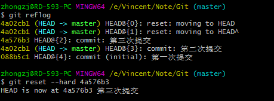
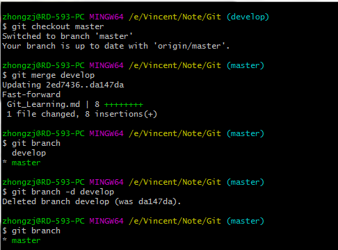
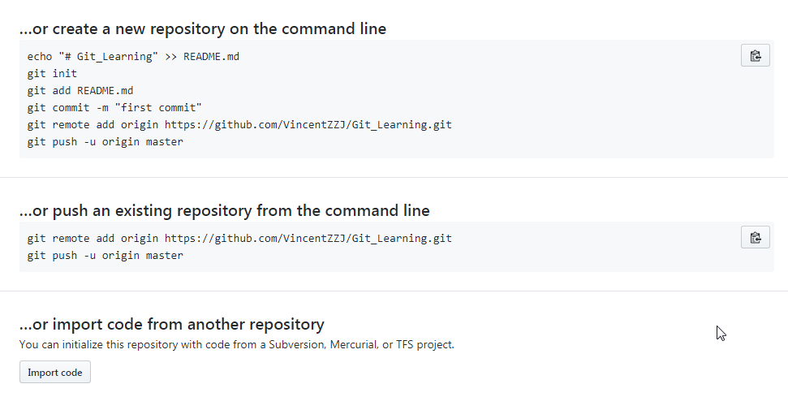

# Git #
----
## 常用命令 ##
+	**本地初始化仓库** ---  `git init`
+	**查看仓库内文件的状态** ---  `git status`
+	**将文件添加到*暂存区*** ---  `git add . / git add ReadMe.md`
+	**将暂存区文件提交到*本地仓库*** ---  `git commit -m "some tips"`
+	**查看提交历史** ---  `git log`
+	**回退版本**
	+	回退上一个版本 --- `git reset --hard HEAD^`
	+	回退到前N个版本 --- `git reset --hard HEAD~n`
	+	回退到指定版本 --- `git reset --hard 版本号`

+	**查看提交历史的版本号(对应上面的回退处理)**	--- `git reflog`  
	+	

+	**查看文件内容** --- `cat ReadMe.md` 
+	**查看文件与上一版本的差异** --- `git diff ReadMe.md`
+	**撤销操作** --- `git checkout --ReadMe.md`
	+	已提交到暂存区(则已经`git add`),撤销后则回到暂存区的文件状态
	+	未提交到暂存区，撤销后则回到上一版本的文件状态

+	**删除文件** --- `rm ReadMe.md`
	+	若想恢复，则可执行撤销操作

+	**本地仓库与远程仓库的关联** --- `git remote add origin https://...`
	+	本地仓库分支推送到远程仓库 --- `git push -u origin 分支名`
	+	由于第一次提交，远程仓库的master是空的，因此上面带了个`-u`,后续可以直接`git push`到远程关联的分支上

+	**创建分支** --- `git checkout -b 分支名`
	+	查看本地已有分支 --- `git branch`
	+	查看远端已有分支 --- `git branch -r`
	+	查看本地和远端所有分支 --- `git branch -a`
	+	切换分支 --- `git checkout 分支名`
	+	分支合并 --- `git merge develop (当前在master分支)`
	+	删除分支 --- `git branch -d 分支名`
	+	
```
这里的合并采用的是“Fast forward”模式，在删除分支后，会丢失该分支的信息，也就是日志没有该分支的记录
```
+	**合并分支(禁用*Fast forward*模式)**
	+	跟上面的例子类似，在develop分支上进行改动，只是合并的时候有不同
## 题外话 ##
+	**往Github上传项目**
